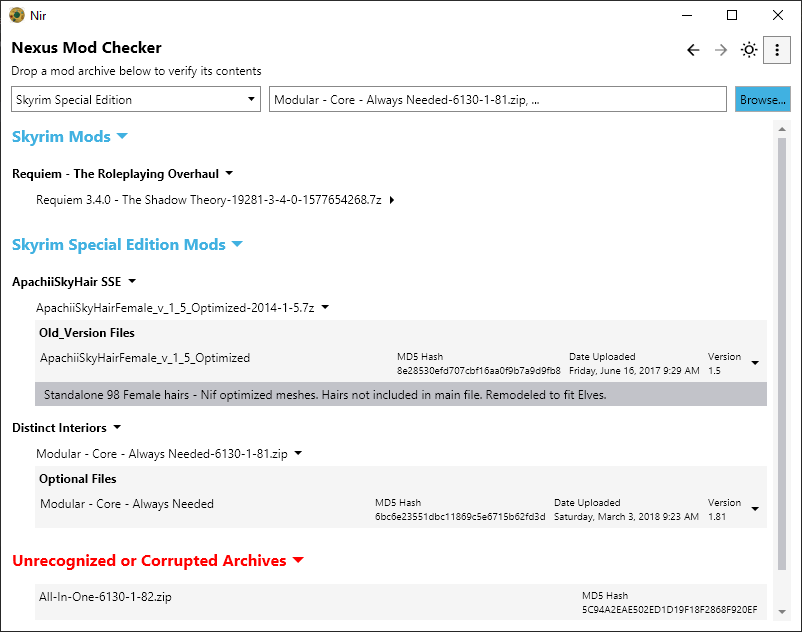
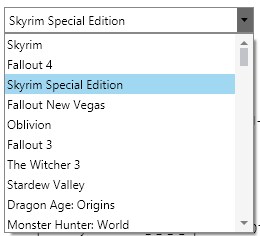
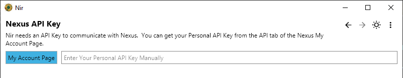

# Nir


Nir is a friendly collection of modding tools. It is plugin-based, themeable and
extensible. The first tool is the **Nexus Mod Checker**.

## Nexus Mod Checker

Do you have a poorly named mod file and you have no idea what mod it belongs to?
Or, have you ever downloaded a multi-gigabyte file and someone told you to
re-download it because your copy may be corrupt? Would you like to know whether
or not you have a good copy before taking the time and bandwidth to re-download
it?

That's where **Nexus Mod Checker** (NMC) comes in. Pick your game and drop one
or more files on NMC, it will read them and look them up on
[NexusMods](https://www.nexusmods.com/).



You can see a few different things above:

* "Requiem" is an oldrim mod.
* Expanding the details for "ApachiiSkyHair", we can see it's on old version.
* The helpfully named "Modular - Core - Always Needed" turns out to be part of
  "Distinct Interiors".
* "All-In-One" is either unrecognized by Nexus, has been deleted or is corrupt.

All Nexus games are supported. Some games like "Skyrim Special Editon" and
"Fallout New Vegas" will fallback to related games if a file isn't found.




## Getting Started

Head over to the [Releases](https://github.com/renngar/Nir/releases) on GitHub,
download the latest archive and unpack it wherever you like, then run `Nir.exe`.

It may prompt for a Nexus ApiKey.  Just click the **My Account Page** button,
scroll to the bottom of Nexus.  Create a Personal API Key if you do not have one
and drop or paste it into the field in Nir.



Once that's done, select your game and you're good to go.

## Development

If you want to build Nir from scratch, clone this repository. Then,

```powershell
dotnet tool restore
dotnet paket restore
dotnet fake build
```

Any pull requests must cleanly pass

```dotnet fake build -t check```

A local git pre-commit hook is installed which performs this check and a couple other things.

## Built With

* [F#](https://dotnet.microsoft.com/languages/fsharp) - .NET Functional
  Programming
* [FSharp.Data](http://fsharp.github.io/FSharp.Data) - F# Data: Library for Data
  Access
* [Avalonia](https://github.com/AvaloniaUI/Avalonia) and
  [Avolonia.FuncUI](https://github.com/AvaloniaCommunity/Avalonia.FuncUI) - User
  Interface
* [FParsec](http://www.quanttec.com/fparsec) - Parser combinators
* [.NET Core Plugins](https://github.com/natemcmaster/DotNetCorePlugins) -
  Plugin Loader
* [Material Icons](https://material.io/resources/icons/?style=outline) - Menu
  and button bar icons
* [Hack](https://github.com/source-foundry/Hack) - Monospaced Font

## Versioning

I use [SemVer](http://semver.org/) for versioning. For the versions available,
see the [tags on this repository](https://github.com/renngar/Nir/tags).

## Authors

* **Renngar**

## License

This project is licensed under the GNU General Public License version 3 - see the [COPYING](COPYING) file for details

## Acknowledgments

* Josua Jäger for the wonderfully [Elmish](https://elmish.github.io/elmish/) [Avolonia.FuncUI](https://github.com/AvaloniaCommunity/Avalonia.FuncUI)
* All the Papug on the Rare Papug Association Discord. (Not the owner, just a fan.)
